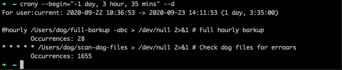

# crony
[](https://travis-ci.com/github/Cygnut/crony)
[](https://coveralls.io/github/Cygnut/crony)

A simple command line program for reporting on crontab job schedules in a provided datetime interval.

Helpful in the following scenarios:
- Determining which jobs should have been run during an outage to 'catch up' your system.
- Forecasting which jobs will run when planning outage/events/other jobs.

<p align="center">
  
</p>

## Installation
pipx is recommended to install crony (https://pipxproject.github.io/pipx/installation/).

For now (until there's an official release), you can install via:
```
pipx uninstall crony && pipx install "git+https://github.com/Cygnut/crony.git@master"
```

## Usage

    $ crony --help
    usage: crony [-h] [--version] [--v | --vv | --vvv] [--begin] [--end]
             [--file | --user] [--include-disabled] [--exclude-header] [--only-command]
             [--d | --dd]

    A simple CLI program for analysing crontabs.

    optional arguments:
      -h, --help              show this help message and exit
      --version, -V           show program's version number and exit
      --v                     log at the warning level
      --vv                    log at the info level
      --vvv                   log at the debug level
      --begin                 the datetime to begin at, defaults to the
                              current datetime. The preferred format is
                              (YYYY-MM-DD HH:MM:SS), however - other relative
                              and absolute formats are permitted
      --end                   the datetime to end at, defaults to the
                              current datetime. The preferred format is
                              (YYYY-MM-DD HH:MM:SS), however - other relative
                              and absolute formats are permitted
      --file                  the path to a crontab to be analysed
      --user                  the user whose crontab is to be analysed
      --include-disabled, -i  also analyse disabled cron jobs
      --exclude-header, -x    exclude the header from the output
      --only-command, -c      only show the command, not the full line
      --d                     output with the level of detail set to: count
      --dd                    output with the level of detail set to: full

The default behaviour is to emit a single line for each enabled job scheduled in the provided interval.

More detail can be increasingly provided with the --d flag:
- --d: The number of planned executions is included
- --dd: The specific execution datetimes are included

In addition to reading a crontab for a user or from a file, the command will also read from stdin if possible.
